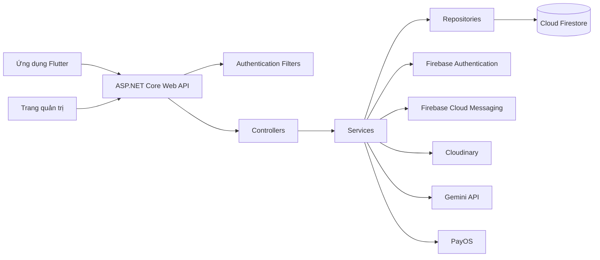

<div align="center">

# 🚦 Driving Test Admin Backend

### Hệ thống Backend API quản trị ứng dụng ôn thi giấy phép lái xe

<p>
  RESTful API được xây dựng bằng ASP.NET Core, hỗ trợ quản lý người dùng,
  diễn đàn cộng đồng, gói VIP, thanh toán, thông báo, thống kê
  và các chức năng tích hợp trí tuệ nhân tạo.
</p>

<p>
  
  
  
  
  
</p>

</div>

---

## 📖 Giới thiệu

**Driving Test Admin Backend** cung cấp hệ thống RESTful API phục vụ ứng dụng hỗ trợ học và ôn thi lý thuyết giấy phép lái xe.

Hệ thống hỗ trợ quản lý người dùng, quản trị viên, bài đăng cộng đồng, bình luận, kiểm duyệt nội dung, thông báo đẩy, gói VIP, thanh toán trực tuyến, nhận diện biển báo giao thông, thông tin trung tâm đào tạo lái xe, thống kê hệ thống và nhiều chức năng quản trị khác.

Backend được tổ chức theo kiến trúc phân lớp nhằm tách biệt các thành phần:

* Controller
* Service
* Repository
* DTO
* Model
* Authentication Filter
* Data Access

---

## ✨ Chức năng chính

### 👤 Quản lý người dùng và quản trị viên

* Xác thực người dùng bằng Firebase ID Token
* Hỗ trợ Bearer Authentication cho ứng dụng client
* Hỗ trợ Basic Authentication khi kiểm thử bằng Swagger
* Quản lý tài khoản, vai trò và trạng thái người dùng
* Khóa hoặc mở khóa tài khoản
* Cấp hoặc thu hồi quyền quản trị viên
* Bảo vệ tài khoản quản trị viên cấp cao
* Đặt lại mật khẩu quản trị viên
* Phân quyền truy cập theo vai trò

### 💬 Diễn đàn cộng đồng

* Tạo, xem, cập nhật và xóa bài đăng
* Tạo và quản lý bình luận
* Thích hoặc bỏ thích bài đăng
* Lấy danh sách bài đăng theo người dùng
* Phân trang danh sách bài đăng
* Tải hình ảnh bài đăng lên Cloudinary
* Gửi thông báo khi có tương tác trên bài viết

### 🛡️ Kiểm duyệt nội dung

* Quản lý danh sách từ khóa bị cấm
* Bật hoặc tắt từng từ khóa kiểm duyệt
* Phát hiện nội dung không phù hợp
* Tự động xử lý nội dung vi phạm
* Tích hợp Gemini AI để hỗ trợ kiểm duyệt
* Kiểm duyệt cả bài đăng và bình luận

### 🤖 Chức năng trí tuệ nhân tạo

* Phát hiện nội dung không phù hợp bằng Gemini AI
* Nhận diện biển báo giao thông từ hình ảnh Base64
* Trả về tên biển báo, nhóm biển báo, ý nghĩa, thông số và lưu ý

### 💎 Quản lý gói VIP

* Tạo gói VIP
* Chỉnh sửa và xóa gói VIP
* Tìm kiếm gói VIP
* Bật hoặc tắt trạng thái hoạt động của gói
* Lấy danh sách các gói đang được cung cấp
* Hỗ trợ gói VIP theo thời hạn hoặc vĩnh viễn

### 💳 Tích hợp thanh toán PayOS

* Tạo liên kết thanh toán PayOS
* Tiếp nhận webhook từ PayOS
* Kiểm tra chữ ký webhook
* Đồng bộ trạng thái thanh toán
* Kích hoạt gói VIP sau khi thanh toán thành công
* Lưu thông tin đơn thanh toán trong Firestore
* Hỗ trợ URL trả về và hủy thanh toán

### 🔔 Thông báo

* Lưu thông báo trong hệ thống
* Lấy danh sách thông báo theo người dùng
* Đánh dấu thông báo đã đọc
* Gửi thông báo đẩy bằng Firebase Cloud Messaging
* Hỗ trợ nhiều FCM Token cho một người dùng

### 📊 Quản trị và thống kê

* Thống kê hệ thống theo khoảng thời gian
* Quản lý cấu hình AdMob
* Lấy báo cáo quảng cáo AdMob
* Quản lý trung tâm đào tạo lái xe
* Quản lý thông tin vi phạm giao thông
* Cấu hình thông báo nhắc lại câu hỏi sai
* Chạy background service để gửi lời nhắc

---

## 🛠️ Công nghệ sử dụng

| Nhóm                    | Công nghệ                                   |
| ----------------------- | ------------------------------------------- |
| Ngôn ngữ                | C#                                          |
| Framework               | ASP.NET Core Web API, .NET 8                |
| Cơ sở dữ liệu           | Google Cloud Firestore                      |
| Xác thực                | Firebase Authentication, Firebase Admin SDK |
| Thông báo đẩy           | Firebase Cloud Messaging                    |
| Tài liệu API            | Swagger, OpenAPI                            |
| Lưu trữ hình ảnh        | Cloudinary                                  |
| Trí tuệ nhân tạo        | Google Gemini API                           |
| Thanh toán              | PayOS                                       |
| Dependency Registration | Scrutor                                     |
| Object Mapping          | AutoMapper                                  |
| Container               | Docker                                      |

---

## 🏗️ Kiến trúc hệ thống



Luồng xử lý chính:

```text
Client
  ↓
Controller
  ↓
Service
  ↓
Repository
  ↓
Cloud Firestore
```

---

## 📁 Cấu trúc dự án

```text
DrivingTestAdmin/
├── Backend/
│   ├── Controllers/
│   │   ├── AdMobConfigController.cs
│   │   ├── AdMobReportController.cs
│   │   ├── AdminPasswordResetController.cs
│   │   ├── AdminStatisticsController.cs
│   │   ├── CommentController.cs
│   │   ├── DrivingCentersController.cs
│   │   ├── ModerationController.cs
│   │   ├── NotificationController.cs
│   │   ├── PaymentController.cs
│   │   ├── PostController.cs
│   │   ├── ProfileController.cs
│   │   ├── TrafficSignRecognitionController.cs
│   │   ├── TrafficViolationsController.cs
│   │   ├── UsersController.cs
│   │   ├── VipPackageController.cs
│   │   └── WrongQuestionReminderController.cs
│   │
│   ├── DTO/
│   ├── Data/
│   ├── Filters/
│   │   ├── AdminAuthorizeAttribute.cs
│   │   └── UserAuthorizeAttribute.cs
│   │
│   ├── Models/
│   ├── Repository/
│   ├── Service/
│   │   └── Interface/
│   │
│   ├── Backend.csproj
│   ├── Backend.http
│   └── Program.cs
│
├── Dockerfile
├── DrivingTestAdmin.sln
└── README.md
```

---

## ⚙️ Yêu cầu hệ thống

Trước khi chạy dự án, cần chuẩn bị:

* .NET 8 SDK
* Firebase Project
* Firebase Service Account Key
* Tài khoản Cloudinary
* Google Gemini API Key
* Tài khoản PayOS
* Docker nếu chạy dự án bằng container

---

## 🚀 Hướng dẫn cài đặt

### 1. Clone repository

```bash
git clone https://github.com/MinhVuong2203/DrivingTestAdmin.git
cd DrivingTestAdmin
```

### 2. Khôi phục các package

```bash
dotnet restore
```

### 3. Cấu hình Firebase

Trong môi trường phát triển local, đặt file Firebase Service Account trong thư mục:

```text
Backend/firebase-key.json
```

> Không được commit file `firebase-key.json` lên GitHub.

Trong môi trường cloud hoặc Docker, chuyển nội dung file Firebase JSON sang Base64 và khai báo biến môi trường:

```env
FIREBASE_KEY_BASE64=your_base64_encoded_firebase_key
```

### 4. Cấu hình ứng dụng

Tạo file:

```text
Backend/appsettings.Development.json
```

Cấu hình mẫu:

```json
{
  "Firebase": {
    "ProjectId": "your-firebase-project-id",
    "WebApiKey": "your-firebase-web-api-key"
  },

  "Cloudinary": {
    "CloudName": "your-cloud-name",
    "ApiKey": "your-cloudinary-api-key",
    "ApiSecret": "your-cloudinary-api-secret"
  },

  "Gemini": {
    "ApiKey": "your-gemini-api-key",
    "Model": "gemini-2.5-flash"
  },

  "GeminiTrafficSignRecognition": {
    "ApiKey": "your-gemini-api-key",
    "Model": "gemini-3.1-flash-lite-preview"
  },

  "PayOS": {
    "ClientId": "your-payos-client-id",
    "ApiKey": "your-payos-api-key",
    "ChecksumKey": "your-payos-checksum-key",
    "ReturnUrl": "https://your-domain.com/api/Payment/payos-return",
    "CancelUrl": "https://your-domain.com/api/Payment/payos-cancel"
  }
}
```

### 5. Chạy backend

```bash
cd Backend
dotnet run
```

API sẽ chạy trên cổng được cấu hình trong ASP.NET Core.

Trong môi trường production, ứng dụng đọc biến môi trường `PORT` và mặc định sử dụng cổng `8080`.

---

## 📚 Tài liệu Swagger

Sau khi khởi động backend, mở địa chỉ:

```text
http://localhost:<port>/swagger
```

Swagger cung cấp giao diện trực quan để kiểm tra và thử nghiệm các API.

---

## 🔐 Xác thực

Các endpoint được bảo vệ yêu cầu header xác thực.

### Firebase Bearer Token

Nên sử dụng cho ứng dụng mobile và môi trường production:

```http
Authorization: Bearer <FIREBASE_ID_TOKEN>
```

### Basic Authentication

Chủ yếu được sử dụng để kiểm thử trên Swagger:

```http
Authorization: Basic <BASE64_EMAIL_AND_PASSWORD>
```

Chuỗi trước khi mã hóa Base64 có định dạng:

```text
email:password
```

Các API dành cho quản trị viên sẽ kiểm tra người dùng trong Firestore có:

```json
{
  "role": "admin",
  "status": "active"
}
```

Quản trị viên cấp cao có thể có thêm thuộc tính:

```json
{
  "isImportant": true
}
```

---

## 🌐 Các nhóm API chính

| Module             | Đường dẫn                     | Mô tả                                                |
| ------------------ | ----------------------------- | ---------------------------------------------------- |
| Người dùng         | `/api/Users`                  | Quản lý người dùng, vai trò và trạng thái tài khoản  |
| Bài đăng           | `/api/Post`                   | Quản lý bài đăng, lượt thích, phân trang và hình ảnh |
| Bình luận          | `/api/Comment`                | Quản lý bình luận cộng đồng                          |
| Kiểm duyệt         | `/api/Moderation`             | Quản lý từ khóa và kiểm duyệt nội dung bằng AI       |
| Thông báo          | `/api/Notification`           | Quản lý thông báo người dùng                         |
| Gói VIP            | `/api/VipPackage`             | Quản lý các gói VIP                                  |
| Thanh toán         | `/api/Payment`                | Tạo và đồng bộ thanh toán PayOS                      |
| Nhận diện biển báo | `/api/TrafficSignRecognition` | Nhận diện biển báo bằng AI                           |
| Vi phạm giao thông | `/api/TrafficViolations`      | Cung cấp thông tin vi phạm giao thông                |
| Trung tâm đào tạo  | `/api/DrivingCenters`         | Quản lý trung tâm đào tạo lái xe                     |
| Thống kê           | `/api/admin/statistics`       | Thống kê dành cho quản trị viên                      |
| Nhắc câu sai       | `/api/WrongQuestionReminder`  | Quản lý lời nhắc ôn tập câu hỏi sai                  |

---

## 🐳 Chạy bằng Docker

### Build Docker Image

Thực hiện tại thư mục gốc của repository:

```bash
docker build -t driving-test-admin-api .
```

### Chạy Docker Container

```bash
docker run --rm \
  -p 8080:8080 \
  -e PORT=8080 \
  -e FIREBASE_PROJECT_ID=your-project-id \
  -e FIREBASE_WEB_API_KEY=your-web-api-key \
  -e FIREBASE_KEY_BASE64=your-base64-key \
  driving-test-admin-api
```

Các cấu hình khác có thể được truyền bằng biến môi trường theo cú pháp của ASP.NET Core:

```env
Cloudinary__CloudName=your-cloud-name
Cloudinary__ApiKey=your-api-key
Cloudinary__ApiSecret=your-api-secret

Gemini__ApiKey=your-gemini-api-key
Gemini__Model=gemini-2.5-flash

GeminiTrafficSignRecognition__ApiKey=your-gemini-api-key
GeminiTrafficSignRecognition__Model=gemini-3.1-flash-lite-preview

PayOS__ClientId=your-client-id
PayOS__ApiKey=your-api-key
PayOS__ChecksumKey=your-checksum-key
PayOS__ReturnUrl=your-return-url
PayOS__CancelUrl=your-cancel-url
```

---

## 🔒 Lưu ý bảo mật

* Không commit Firebase Service Account Key lên GitHub
* Không công khai Cloudinary API Secret
* Không công khai Gemini API Key
* Không công khai thông tin PayOS
* Sử dụng biến môi trường trong production
* Luôn sử dụng HTTPS khi triển khai
* Kiểm tra chữ ký webhook của PayOS trước khi xử lý thanh toán
* Sử dụng Firebase Bearer Token cho ứng dụng production
* Giới hạn CORS trước khi triển khai công khai

---

## 📱 Ứng dụng liên quan

Ứng dụng Flutter sử dụng backend này:

[Driving Test Mobile Application](https://github.com/MinhVuong2203/Driving_Test)

---

## 🤝 Đóng góp dự án

### 1. Fork repository

Fork dự án về tài khoản GitHub của bạn.

### 2. Tạo nhánh mới

```bash
git checkout -b feature/ten-chuc-nang
```

### 3. Commit thay đổi

```bash
git commit -m "Thêm chức năng mới"
```

### 4. Push nhánh lên GitHub

```bash
git push origin feature/ten-chuc-nang
```

### 5. Tạo Pull Request

Mở Pull Request để gửi thay đổi vào repository chính.

---

<div align="center">

### 🚗 Học an toàn – Lái xe có trách nhiệm

Được xây dựng với ASP.NET Core, Firebase, Firestore và các dịch vụ AI.

</div>
